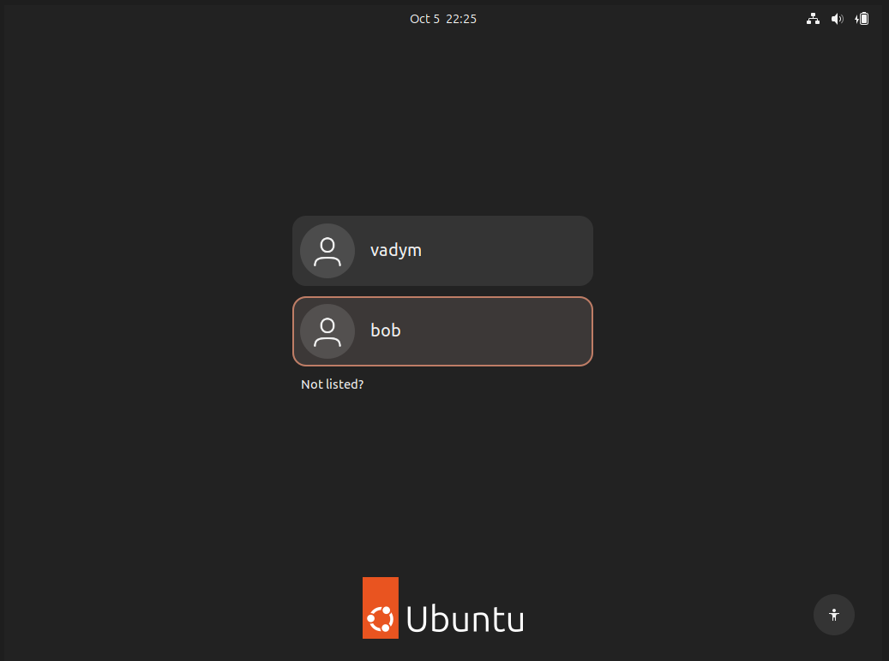
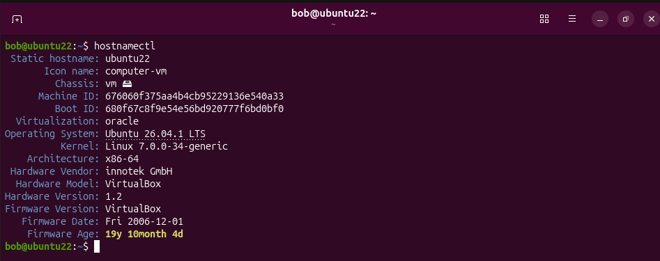
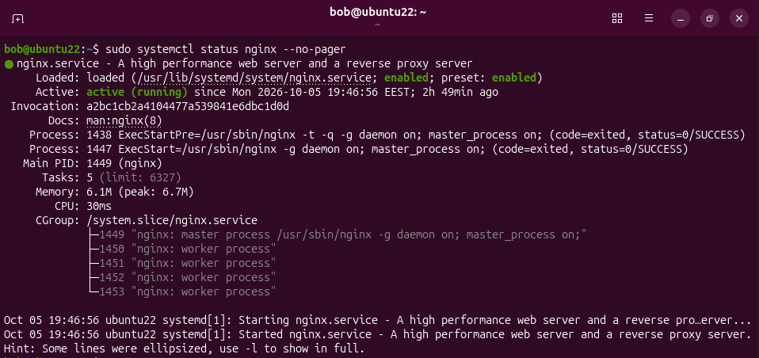
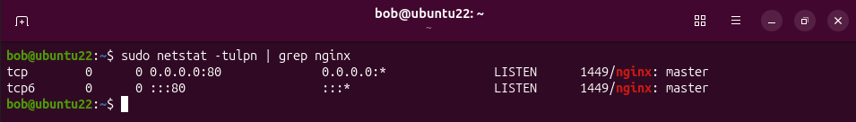

# Створення користувача bob: 

Є два варіанти як створити користувача
> _sudo useradd -m -s /bin/bash -G sudo bo_ - в такому випадбку ми при створенні користувача одразу задаємо і створюємо домашню дерикторію та додаємо користувача до групи користувачів _sudo_

> Використовуючи декілька команд як я і робив:  
>> _sudo useradd bob_ - Додаємо користувача з ім'ям боб  
>> _sudo usermod -s /bin/bash bob_ - модифікуємо користувача щоб задати йому оболнку  
>> _sudo usermod -aG sudo bob_ - Можифікуємо користувача щоб додати його до групи користувачів  _sudo_  
>> _sudo mkdir /home/bob_ - створюємо домашню директорію для користувача  
>> _sudo chown bob:bob /home/bob_ - передаємо права на директорію новому користувачу  
>> _sudo chpasswd_ - задаємо пароль користувачу  

Далі створюємо скрипт *change_hostname.sh*. Зробити це з терміналу можна наступним чином: 

> _cd /home/bob_ - Щоб опинитись в необхідній дерикторії  
> *printf '#!/bin/bash\nsudo hostnamectl set-hostname ubuntu22' > change_hostname.sh* - Ми виводимо інформацію з табуляцією і повідомляємо  системі що її потрібно зберегти у файл *change_hostname.sh*

Наступним кроком передаємо права власності на файл новому користувачу та встановлюємо права запуску лише для нього:  
>sudo chown bob:bob change_hostname.sh  
>sudo chmod 700 change_hostname.sh

Запускаємо сценарій наступним чином:  
> *sudo -u bob -i* - Заходимо як користувач bob  
> *sudo  ./change_hostname.sh* - запускаємо скрипт  
>(Додатково на цьому етапі можна перевірити чи хост змінився командою *hostnamectl*)

Перезапускаємо систему командою *reboot* та спостерігаємо картину зі screenshot_01 після перезапуску: 

Перевіряємо в термінал чи змінено хостнейм: 

Проводимо встановлення *ngnix* за допомогою наступної команди:  
> _sudo apt install nginx_

Перевіряємо чи сервіс запущено за допомогою команди   
> _sudo systemctl status nginx --no-pager_

Бачимо наступну картину що підтверджує коректне встановленя та запуск *ngnix*: 

Встановлюємо *net-tools* командою *sudo apt install net-tools* та дивимось які порти відкриті за допомогою команди *sudo netstat -tulpn | grep nginx*: 

**Додатково я створив файл-сценарій який створює автоматично користувача, файл сценарію для зміни імені хоста, запускає його, проводить встановлення *ngnix*, *net-tools* та виводить всю необхідну інформацію в консоль (тобто проводить всю роботу по цьому завданню окрім перезапуску і входу як новий користувач)**  
> Пароль від створеного користувача bob який створений через сценарій **1**. 